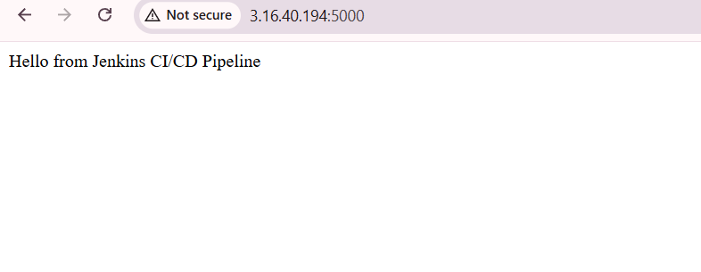
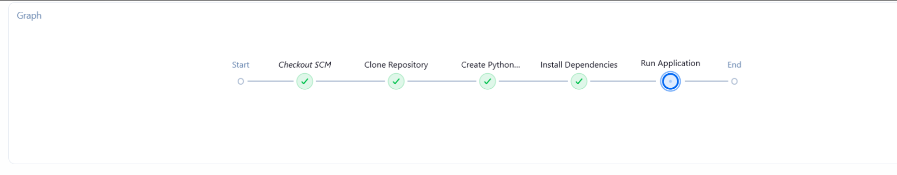

# Jenkins CI/CD Pipeline Project

## Project Overview

This project demonstrates a basic **CI/CD pipeline using Jenkins integrated with GitHub**.

Whenever code is pushed to the GitHub repository, Jenkins automatically triggers a pipeline that builds, tests, and deploys a simple Python web application.

This project helped me understand how modern DevOps workflows automate software delivery.

---

## Architecture

Developer → GitHub → Jenkins Pipeline → Build → Test → Deploy → Web Application

---

## Technologies Used

* Jenkins
* Git
* GitHub
* Python
* Flask
* Linux
* Bash scripting

---

## Project Structure

```
jenkins-cicd-project
│
├── app.py
├── requirements.txt
├── test_app.py
├── Jenkinsfile
└── README.md
```

---

## Jenkins Pipeline Stages

The Jenkins pipeline performs the following steps:

1. Clone repository from GitHub
2. Install application dependencies
3. Run unit tests
4. Deploy the application

---

## Screenshots
---

### Application Running



---

### Pipeline Running



---

## Learning Outcomes

Through this project I learned:

* Basics of Continuous Integration and Continuous Deployment (CI/CD)
* How Jenkins pipelines automate software workflows
* Integration between GitHub and Jenkins
* Running automated tests during builds
* Deploying applications through CI/CD pipelines

---
